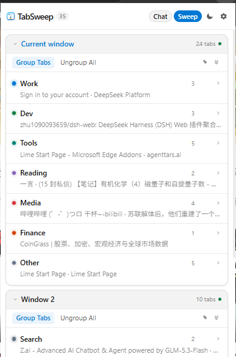
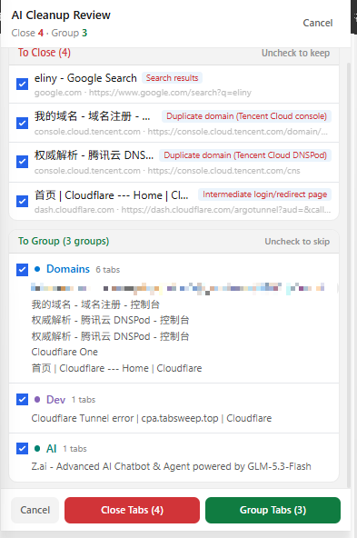
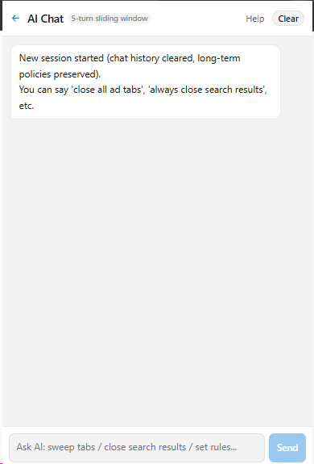

<p align="center">
  
</p>

<h1 align="center">TabSweep AI</h1>

<p align="center">
  <strong>一个纯自然语言规则与语言模型驱动的浏览器标签清理与分组插件</strong>
</p>

<p align="center">
  <a href="LICENSE"></a>
  
  
  
  
</p>

<p align="center">
  <a href="README.md">🇺🇸 English</a> · <strong>🇨🇳 简体中文</strong>
</p>

---

## 💡 这是什么？

**TabSweep AI** 是一个**纯自然语言规则与大语言模型（LLM）驱动的浏览器标签页清理与分组插件**。

不同于传统标签管理插件依赖死板的“域名/关键词硬编码匹配”，TabSweep AI 将你的整理习惯写成**一段纯自然语言规则（Policies）**，交由语言模型理解网页上下文，自动帮你判断**哪些杂乱标签该关、哪些标签该归为哪一组**。

### 🎯 适用场景与人群

- **不喜欢随手关标签的“标签囤积”人群**：浏览器常年挂着几十上百个标签页，找网页大海捞针，手动逐个关闭又太费精力。
- **快速批量关闭同类冗余标签**：比如查资料时开了十几个 Google/Bing 搜索结果页、同一个后台开了多个重复控制台页、或者残留了各种登录跳转中间页，一键精准识别并批量清理。
- **需求复杂、需要自然语言规则定制**：每个人的工作流千差万别，简单的固定分类根本不够用。在这里你可以直接用大白话制定复杂规则（例如：*“同一网站最多只留最有用的 1 个”、“B站只留视频播放页，首页和搜索页全关掉”、“把腾讯云和 Cloudflare 相关的都分到 Domains 组”*）。

### 💰 极致的调用成本

不必担心大模型 Token 消耗！经实测，使用高性价比模型（如 **DeepSeek V4.1 Flash**），**单次调用成本仅约人民币 ¥0.0049 元**（不到半毛钱）。花几分钱即可享受几十次精准、懂你心意的智能标签大扫除；同时也支持接入本地 Ollama / vLLM 实现完全免费的离线运行。

---

## 📸 界面预览

| 主界面与多窗口分组 | AI 清理与分组审核流 | AI 对话与规则定制 |
| :---: | :---: | :---: |
|  |  |  |
| 清晰展示当前窗口分组与标签概览 | 列出每条关闭理由与分组建议，勾选确认后执行 | 对话式操作标签，一句话更新长期整理规则 |

---

## 🌟 核心特性

- 🧹 **AI 整理审核流（AI Sweep）**：基于大模型原生 Tool Calling 分析当前窗口标签，生成「建议关闭（附带具体原因）」与「建议分组」清单。**先预览勾选、确认后再执行**，且自动保护当前活动标签（Active Tab）不被误关。
- ⚡ **一键快速分组（Group Tabs）**：无需弹窗确认，直接根据你的自然语言策略快速将当前窗口标签归类分组，严格锁定所属窗口，杜绝跨窗口漂移。
- 💬 **AI 对话助手（Agent Chat）**：支持多轮对话与自主工具调用（`list_tabs`、`close_tabs`、`group_tabs`、`update_policies`），内置 5 轮滑动窗口记忆，你可以直接发号施令：“把所有购物网站关掉”或“以后遇到文档页都归到学习组”。
- 🧠 **纯自然语言规则（Custom Policies）**：设置页内置自然语言规则编辑器，支持一键导入/导出 `.txt` 规则文件，随时备份与调教你的专属整理逻辑。
- 🌐 **多模型自由接入（BYOK & Local）**：内置 DeepSeek、通义千问 (Qwen)、月之暗面 (Kimi)、智谱 (GLM)、MiniMax、OpenAI、Claude、Gemini 预设，并支持任意 OpenAI 兼容接口与本地模型（Ollama / vLLM / LM Studio）。
- 🔒 **100% 隐私安全**：无任何开发者后端服务器，API Key 与规则仅保存在浏览器本地 `chrome.storage.local`，权限精简至仅需 `tabs`、`tabGroups` 与 `storage`。详见 [Privacy Policy](docs/PRIVACY_POLICY.md)。

---

## 🚀 快速上手

### 方式一：直接下载安装（推荐）

1. 前往本仓库的 **[Releases](https://github.com/worrrr/TabSweep/releases)** 页面，下载最新的 `tabsweep-ai-v1.0.0.zip` 并解压到本地文件夹；
2. 打开浏览器扩展管理页面：
   - **Edge**: `edge://extensions/`
   - **Chrome**: `chrome://extensions/`
3. 开启页面右上角的 **「开发者模式」 (Developer mode)**；
4. 点击 **「加载解压缩的扩展」 (Load unpacked)**，选择刚刚解压出来的文件夹即可。

### 方式二：从源码构建

```bash
# 克隆仓库
git clone https://github.com/worrrr/TabSweep.git
cd TabSweep

# 安装依赖
pnpm install

# 生产环境构建（产物输出至 dist 目录）
pnpm build
```

构建完成后，在浏览器扩展管理页加载 `dist` 目录即可。

---

## ⚙️ 模型配置参考

点击扩展右上角 ⚙️ 进入设置页，填入对应服务商的 API Key 即可使用：

| 服务商 | 模型示例 | 特点与成本说明 |
|---|---|---|
| **DeepSeek** | `deepseek-chat` / `deepseek-v4.1-flash` | **强烈推荐**，响应极快，单次调用成本仅约 **¥0.0049 元** |
| **通义千问 (Qwen)** | `qwen-turbo` / `qwen-plus` | 阿里云百炼平台，中文理解稳定 |
| **Kimi (Moonshot)** | `moonshot-v1-8k` | 月之暗面开放平台 |
| **智谱 AI (GLM)** | `glm-4-flash` | BigModel 开放平台 |
| **本地模型 (Custom)** | `http://localhost:11434/v1` | 对接 Ollama / vLLM，免 API Key，完全离线免费 |

---

## 🛠️ 开发与测试命令

```bash
pnpm dev          # 启动开发服务器（热更新）
pnpm test         # 运行全量单元测试（Vitest）
pnpm typecheck    # 运行 TypeScript 类型检查
pnpm build        # 生产环境打包构建
```

---

## 📄 开源许可与致谢

- 本项目基于开源项目 [TabPilot](https://github.com/florianlanx/tabpilot)（作者 Florian）二次深度开发。
- 本项目遵循 **[MIT License](LICENSE)** 开源许可证。原作者版权声明完整保留于 `LICENSE` 文件中（Copyright (c) 2025-present Florian）。
